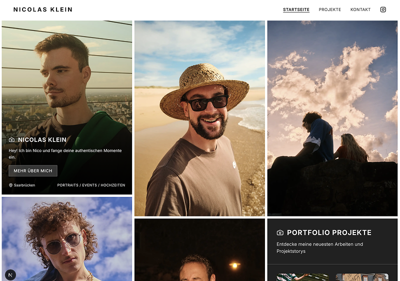

# 📸 No Bullshit Photography Portfolio

No bullshit photography portfolio built with Next.js and Strapi CMS. Initial UI scaffolded with v0.



## Stack

-   Next.js 15
-   Tailwind CSS
-   Framer Motion
-   Strapi CMS
-   Vercel deployment

## Development

```bash
pnpm install
pnpm dev
```

## Q&A

Q: Why Strapi?
A: Because we currently use it at work, and I wanted an excuse to dive deeper into Strapi.

Q: How much of the UI generated by V0 is still in the project?
A: Only the horizontal scrolling gallery component for project stories stayed from the v0 generation. The rest of the UI has progressively been rebuilt.

## License

[MIT License](http://zenorocha.mit-license.org/) © Nicolas Klein
