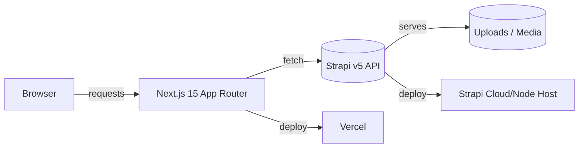

### 📸 Photography Portfolio (Next.js + Strapi)

[](https://vercel.com/new/clone?repository-url=https%3A%2F%2Fgithub.com%2Fhey-nicolasklein%2Fphotography&root-directory=photography-portfolio&project-name=photography-portfolio&repository-name=photography-portfolio&env=NEXT_PUBLIC_STRAPI_URL,STRAPI_API_TOKEN,VERCEL_ANALYTICS_ID&envDescription=Set%20your%20Strapi%20URL%20and%20API%20token%20(see%20example.env).&envLink=https%3A%2F%2Fgithub.com%2Fhey-nicolasklein%2Fphotography%2Fblob%2Fmain%2Fphotography-portfolio%2Fexample.env)

[](https://nextjs.org/docs) [](https://docs.strapi.io/) [](https://tailwindcss.com/docs) [](https://vercel.com/)
[](#license)



Modern, no-nonsense photography portfolio built with Next.js 15 and a Strapi CMS backend. The UI is animated, mobile-first, and fast by default.


## Stack

- **Framework**: Next.js 15 (App Router)
- **Styling**: Tailwind CSS
- **Animations**: Framer Motion
- **CMS**: Strapi v5
- **Hosting**: Vercel (frontend), any Node host or Strapi Cloud (backend)

## Features

- **Large mosaic layout**: Masonry-style grid with large, edge-to-edge imagery for visual impact.
- **Full-screen previews**: Immersive lightbox with swipe/keyboard support.
- **Projects view**: Group images by project or client with dedicated pages.
- **Subtle motion**: Tasteful micro-interactions powered by Framer Motion in nav, buttons, and galleries.
- **“Störer” content cards in-grid**: Inline content modules for bio, project intros, and calls-to-action placed directly in the image flow.
- **Sharing dialog with live QR**: One-tap share dialog that renders a QR code dynamically for quick phone handoff.

## Prerequisites

- Node.js 20 or 22
- pnpm (recommended): `npm i -g pnpm`
- Strapi backend in `../photography-strapi` (see backend README)

## Quick start (local)

1) Install dependencies

```bash
pnpm install
```

2) Configure environment

Copy `example.env` to `.env.local` and set values:

```bash
cp example.env .env.local
```

`.env.local` keys:

```bash
NEXT_PUBLIC_STRAPI_URL=http://localhost:1337
STRAPI_API_TOKEN=your_strapi_api_token
# Optional (Vercel Analytics)
# VERCEL_ANALYTICS_ID=...
```

3) Start the Strapi backend (in a separate terminal)

```bash
cd ../photography-strapi
pnpm install
pnpm develop
```

- Create the initial admin user at `http://localhost:1337/admin`.
- Create an API Token: Settings → API Tokens → New Token → copy the value into `STRAPI_API_TOKEN`.
- Public permissions: Settings → Roles → Public → enable "find"/"findOne" for `bio`, `gallery-item`, `portfolio-item`, and `story`.

4) Run the frontend

```bash
pnpm dev
```

Visit `http://localhost:3000`.

## What the frontend expects from Strapi

- **bio**: `tags` (string), `title` (string), `description` (text), `profileImage` (single media)
- **gallery-item**: `tag` (string), `image` (media, multiple allowed)
- **portfolio-item**: `Title` (string), `Description` (string), `FullImage` (single media)
- **story**: `title` (string), `description` (text), `images` (media, multiple), uses `createdAt`

Types are defined in `types/strapi.ts`. Fetching logic lives in `lib/strapi.ts`.

## Scripts

```bash
pnpm dev       # Run Next.js in development
pnpm build     # Build for production
pnpm start     # Start production server (after build)
pnpm lint      # Lint
```

## Deployment

- **Frontend (Vercel)**
  - Set env vars: `NEXT_PUBLIC_STRAPI_URL`, `STRAPI_API_TOKEN`, optional `VERCEL_ANALYTICS_ID`.
  - If your Strapi assets are served from a different domain, update `images.remotePatterns` in `next.config.mjs` to include that host.

- **Backend (Strapi)**
  - Deploy to Strapi Cloud or any Node host. Ensure CORS allows your frontend origin and create a production API token with the required access.

### Environment variables

| Name | Required | Example |
| --- | --- | --- |
| `NEXT_PUBLIC_STRAPI_URL` | Yes | `https://your-strapi.example.com` |
| `STRAPI_API_TOKEN` | Yes | `strapi_api_token_here` |
| `VERCEL_ANALYTICS_ID` | Optional | `...` |

## Troubleshooting

- **401/403 from Strapi**: Check `STRAPI_API_TOKEN` and public role permissions.
- **Images don’t load**: Make sure asset URLs are absolute (handled in `lib/strapi.ts`) and that the image host is allowed in `next.config.mjs` `images.remotePatterns`.
- **Type mismatches**: Align your Strapi content fields with `types/strapi.ts` or adjust types and mappers accordingly.

## Notes

- The UI was initially scaffolded with v0; only the stories horizontal gallery remains from the original scaffold.

## License

[MIT License](http://zenorocha.mit-license.org/) © Vibe coded with ❤️ by Nicolas Klein
